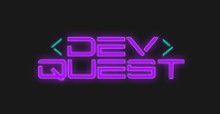

<h1 align="center"> Curso de Programação FullStack - DevQuest </h1> 

Curso de Desenvolvimento Web FullStack - Reconhecido pelo <a href="https://www.gov.br/mec/pt-br">Mec</a>.

  
  <a href="#-screenshots">Screenshots</a>&nbsp;&nbsp;&nbsp;|&nbsp;&nbsp;&nbsp;
  <a href="#-technologies">Technologies</a>&nbsp;&nbsp;&nbsp;|&nbsp;&nbsp;&nbsp;
  <a href="#-features">Features</a>&nbsp;&nbsp;&nbsp;|&nbsp;&nbsp;&nbsp;
  <a href="#-academi-exercises">Academic Exercises</a>&nbsp;&nbsp;&nbsp;|&nbsp;&nbsp;&nbsp;
  <a href="#-license">License</a>  

  

 

  

 

## 🛠 Technologies

- HTML;
- CSS;
- JavaScript;
- Node;
- Git e GitHub.

## ✨ Features

1. FrontEnd;
2. BackEnd;
3. APIs Rest;
4. Banco de dados;
5. Marketing pessoal.

## 💻 Academic Exercises

- This repository was created to practice the exercises proposed by the professors.

## 📜 License

* This project is licensed under the [MIT License](https://choosealicense.com/licenses/mit/)
